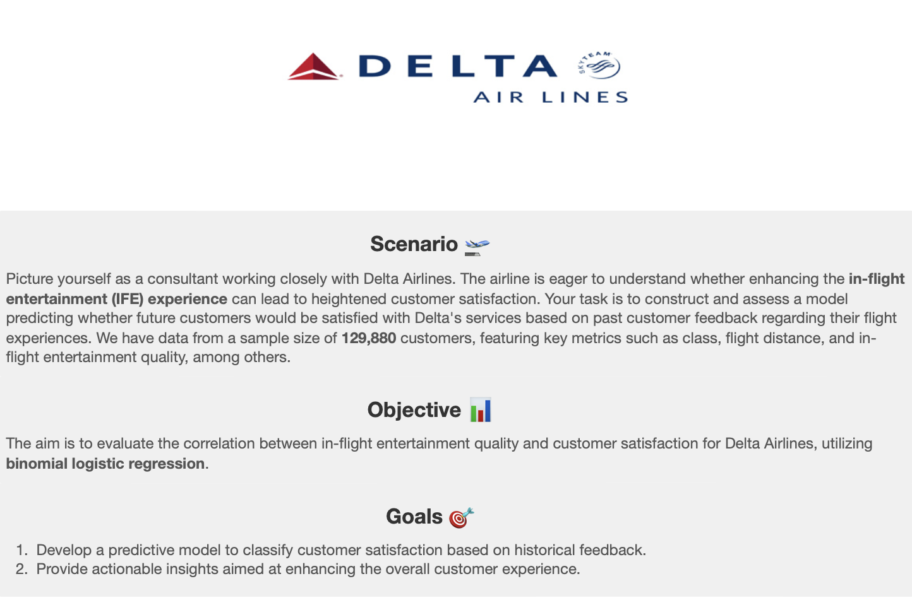

**Disclaimer**: This scenario is hypothetical and designed to simulate a real-world situation. The dataset and its analysis are purely for illustrative purposes to simulate real-world scenarios

## Executive Summary
* Logistic regression accurately predicted satisfaction 80.2 percent of the time.
* The confusion matrix is useful, as it displays a similar amount of true positives and true negatives.
*  Customers who rated in-flight entertainment highly were more likely to be satisfied. Improving in-flight entertainment should lead to better customer satisfaction. 
*  The model is 80.2 percent accurate. This is an improvement over the dataset's customer satisfaction rate of 54.7 percent. 
*  The success of the model suggests that the airline should invest more in model developement to examine if adding more independent variables leads to better results. Building this model could not only be useful in predicting whether or not a customer would be satisfied but also lead to a better understanding of what independent variables lead to happier customers. 
