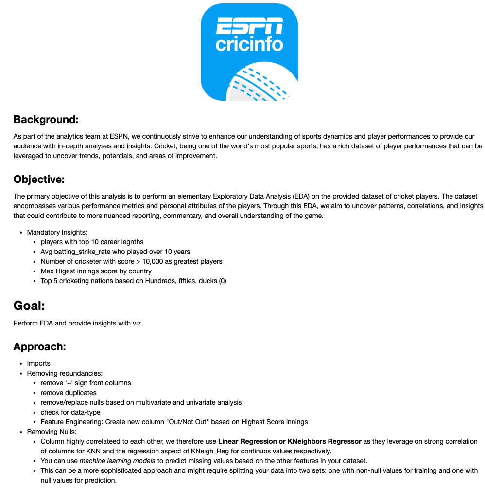

**Disclaimer**: This scenario is hypothetical and designed to simulate a real-world situation. The dataset and its analysis are purely for illustrative purposes to simulate real-world scenarios

#### Data Overview
The dataset comprises various columns representing cricket player statistics, including runs, wickets, centuries, half-centuries, ducks, and other performance metrics. It also includes player nationality, which enables cross-national comparisons.

### Executive Summary of ESPN Cricket EDA

#### Key Findings

1. **Top Performers Analysis**
   - Identified top-performing players based on cumulative runs, wickets, and centuries.
   - Visualized top players using bar charts and scatter plots.

2. **Nation-wise Performance Comparison**
   - Compared average performance metrics of players from different countries.
   - Significant differences found in player performance across nations.

3. **Performance Trends Over Time**
   - Analyzed trends in player performance over different periods.
   - Highlighted eras of peak and decline in performance.

4. **Correlation Analysis**
   - Explored relationships between different performance metrics.
   - Strong correlations found between runs and centuries.

5. **Top 10 Players with Longest Careers**
   - Highlighted players with the longest cricket careers, including GA Headley and SR Tendulkar.
   - Bar chart illustrated career lengths ranging from 20 to 25 years.

6. **Average Batting Strike Rate for Players with Careers over 10 Years**
   - Average batting strike rate for players with careers over 10 years is approximately 50.12.

7. **Greatest Players with Over 10,000 Runs**
   - Identified players with over 10,000 runs, including SR Tendulkar and JH Kallis.
   - Visualized top 10 greatest players by runs.

8. **Top 10 Mid Players with Under 10,000 Runs**
   - Highlighted players with significant contributions under 10,000 runs, such as SPD Smith and V Kohli.
   - Visualized top 10 mid players by runs.

9. **Max Highest Innings Score by Country**
   - Highlighted peak innings scores by players from different countries, including ML Hayden and BC Lara.

10. **Top 5 Cricketing Nations by Performance Metrics**
    - Ranked top 5 cricketing nations based on hundreds, fifties, ducks, and average runs.
    - Sri Lanka, India, and Pakistan were among the top nations.

11. **Visualizations**
    - Utilized various visualizations to present data insights clearly.

#### Conclusion
The EDA provides valuable insights into cricket player performance and national trends. The findings can be used by analysts, coaches, and enthusiasts to understand player strengths and make informed decisions.

#### Recommendations
- **Further Analysis**: Include additional metrics like strike rates and bowling economy.
- **Predictive Modeling**: Develop models to forecast future performance.
- **Data Enrichment**: Incorporate more detailed data to refine analysis.

