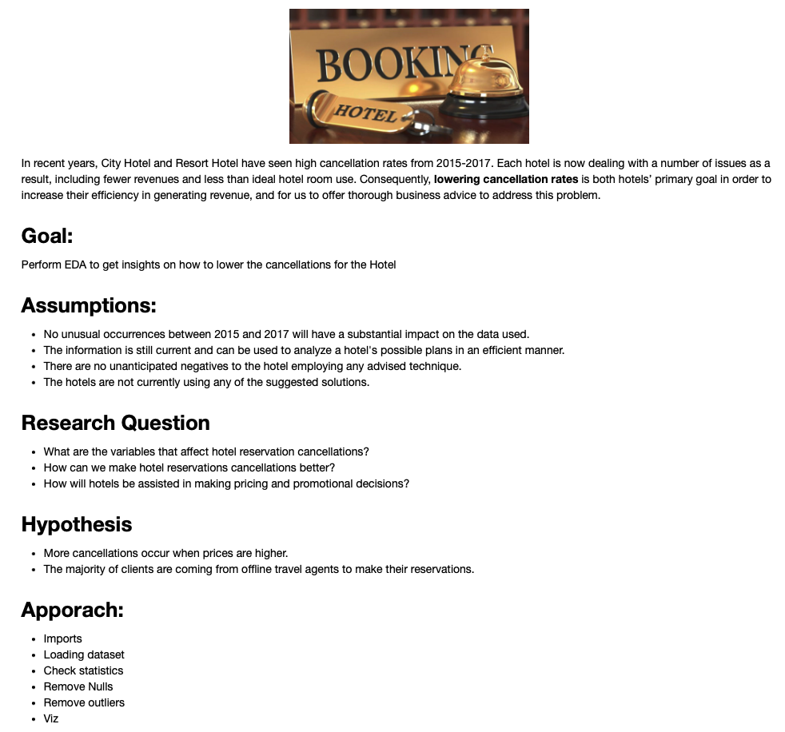

## Executive Summary

The analysis of hotel bookings provides comprehensive insights into patterns and trends, focusing on cancellations, booking channels, customer demographics, and financial aspects. The overall cancellation rate stands at 37.1%, with city hotels experiencing a higher cancellation ratio of 41.7% compared to 27.9% for resort hotels.

Most bookings are made through online travel agencies (Online TA), accounting for 56,402 bookings, followed by offline travel agents and tour operators (Offline TA/TO) with 24,159 bookings, and group bookings at 19,721. Direct bookings amount to 12,448. Among these, online travel agencies also have the highest number of cancellations at 20,738, indicating a need to focus on reducing cancellations from this channel.

Financial analysis shows that the average daily rate (ADR) fluctuates significantly during cancellations. Additionally, seasonal trends reveal that bookings peak during summer months, with city hotels showing higher weekday bookings, likely due to business travel patterns.

Customer demographics indicate that most customers make zero or one special request, and the majority do not require car parking spaces. These insights suggest that enhancing specific services based on customer feedback, particularly for city hotels, could reduce cancellation rates and improve overall satisfaction.

Visualizations, including bar charts and pie charts, effectively illustrate the distribution of cancellations, market segments, and special requests. Line and bar charts further highlight ADR trends and comparisons between canceled and non-canceled bookings.

### Key Findings

1. **Cancellation Rates**
   - Overall: 37.1%
   - City Hotels: 41.7%
   - Resort Hotels: 27.9%

2. **Booking Channels**
   - Online TA: 56,402 bookings
   - Offline TA/TO: 24,159 bookings
   - Groups: 19,721 bookings
   - Direct: 12,448 bookings

3. **Average Daily Rate (ADR)**
   - Mean ADR fluctuates during cancellations.

4. **Customer Demographics**
   - Special Requests: Mostly zero or one.
   - Car Parking: Majority do not require.

5. **Seasonality**
   - Peaks in summer, higher weekday bookings in city hotels.

### Recommendations

To address the findings, targeted marketing strategies should be developed to reduce cancellations for city hotels by understanding and addressing the specific reasons behind higher cancellation rates. Leveraging peak booking periods with dynamic pricing models can optimize revenue, especially during summer months. Offering incentives for direct bookings can also reduce reliance on online travel agencies.

Enhancing customer experience by improving services and facilities, particularly for city hotels, will help meet the needs of customers with higher special requests, further reducing cancellation rates and boosting customer satisfaction.

### Conclusion

The exploratory data analysis offers valuable insights into booking behaviors, customer demographics, and financial impacts. By utilizing these findings, hotels can refine their marketing strategies, adjust pricing models, and enhance overall customer experience, leading to increased revenue and reduced cancellation rates.
