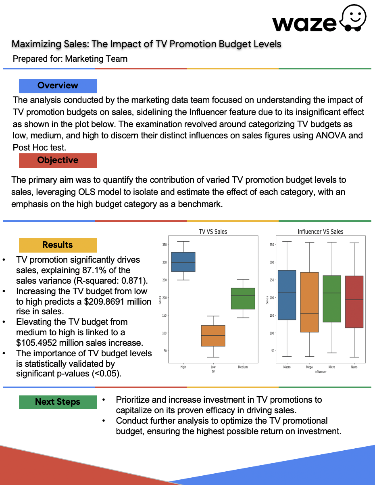

**Disclaimer**: This scenario is hypothetical and designed to simulate a real-world situation. The dataset and its analysis are purely for illustrative purposes to simulate real-world scenarios

# Goal: 
Stakeholders want to know if sales are ignificantly differnet among various TV and influencer promotion types

  

