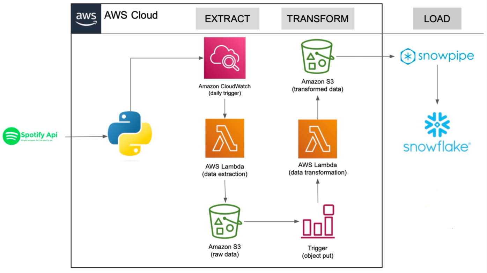

# Spotify ETL Pipeline 
This project demonstrates an ETL (Extract, Transform, Load) pipeline that extracts data from the Spotify API, processes it, and loads it into a Snowflake data warehouse. The pipeline focuses on extracting data related to the top trending albums and creating normalized tables in Snowflake.

## Architecture

  

## Components

- **Spotify API**: The source of the data. We use the Spotify API to extract information about top trending albums.
- **AWS Cloud**: The cloud environment where the ETL pipeline is hosted.
- **Amazon CloudWatch**: Schedules a user based trigger to initiate the ETL process.
- **AWS Lambda (Data Extraction)**: Executes the data extraction logic, using the `spotipy` package to fetch data from the Spotify API. The extracted raw data is then stored in Amazon S3.
- **Amazon S3 (Raw Data)**: Storage service used to store the raw data extracted from the Spotify API.
- **Trigger (Object Put)**: Initiates the data transformation process when new raw data is uploaded to S3.
- **AWS Lambda (Data Transformation)**: Processes and transforms the raw data into a structured format suitable for loading into Snowflake. This step includes data cleaning, normalization, and aggregation.
- **Amazon S3 (Transformed Data)**: Stores the transformed data before loading it into Snowflake.
- **Snowpipe**: Automates the data loading process from Amazon S3 into Snowflake.
- **Snowflake**: The data warehouse where the transformed data is stored in normalized tables, enabling efficient querying and downstream analysis.

## Workflow

### Extract
- The process is triggered daily by Amazon CloudWatch.
- AWS Lambda function extracts data from the Spotify API and stores it as raw data in Amazon S3.

### Transform
- A trigger initiates the AWS Lambda function to transform the raw data.
- The transformation process includes cleaning and normalizing the data, and storing the transformed data in another S3 bucket.

### Load
- Snowpipe automatically detects new data in the S3 bucket and loads it into Snowflake.
- The data is organized into normalized tables within the Snowflake data warehouse.

## Technologies Used

- **AWS Lambda**: For serverless data extraction and transformation.
- **Amazon S3**: For scalable storage of raw and transformed data.
- **Amazon CloudWatch**: For scheduling and monitoring the ETL process.
- **Snowpipe**: For automated data loading into Snowflake.
- **Snowflake**: For scalable, cloud-based data warehousing.
- **Spotipy**: A lightweight Python library for the Spotify Web API.
