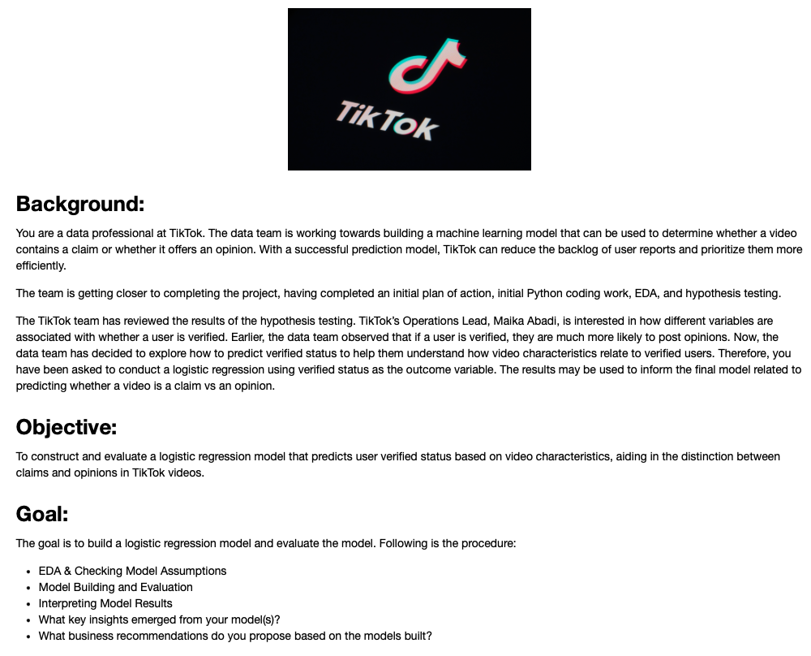

### Executive Summary
This technical report presents the findings of statistical tests conducted to understand the relationship between product categories and preferred shipping modes among Superstore customers. The analysis aims to determine if any significant association exists that could inform strategic decision-making in sales and operations planning.

### Analysis Findings
- **Chi-Square Test of Independence**
  - The test yielded a chi-squared statistic of `3.74`, which represents the divergence between observed and expected frequencies.
  - With a **p-value of 0.711**, there is no statistically significant evidence to suggest an association between product categories and shipping mode preferences.
  - **Degrees of freedom**: The analysis accounted for `6 degrees of freedom`, derived from the number of categories in the contingency table minus one.
  - **Expected Frequencies**: Our calculations across the product categories and shipping modes showed no remarkable deviation from what was expected, thereby supporting the null hypothesis.

- **Chi-Square Test for Goodness of Fit**
  - The p-value here was `0.4127`, which is greater than the standard significance level of `0.05`. 
  - This indicates that the distribution of product category preferences does not significantly differ from the expected distribution based on shipping mode preferences.

### Conclusions
Based on the chi-squared tests, we find no significant dependency between product categories and the preferred shipping modes. The lack of statistical significance suggests that other factors may drive customer preferences and decisions regarding shipping modes.

### Recommendations for Stakeholders
- When planning sales and marketing strategies, stakeholders should not prioritize the alignment of product categories with shipping modes based on the current data.
- Further research is recommended to identify other potential variables that may influence customer preferences for shipping modes.
- Investigating customer behavior, demographic factors, and purchase patterns could offer more insights into how to optimize product delivery and enhance customer satisfaction.

### Additional Notes
- The analysis assumes that the sampling and data collection methods are accurate and that the contingency table correctly reflects the customer population.
- Future analyses may benefit from a larger sample size or a more detailed breakdown of product categories and shipping modes.
