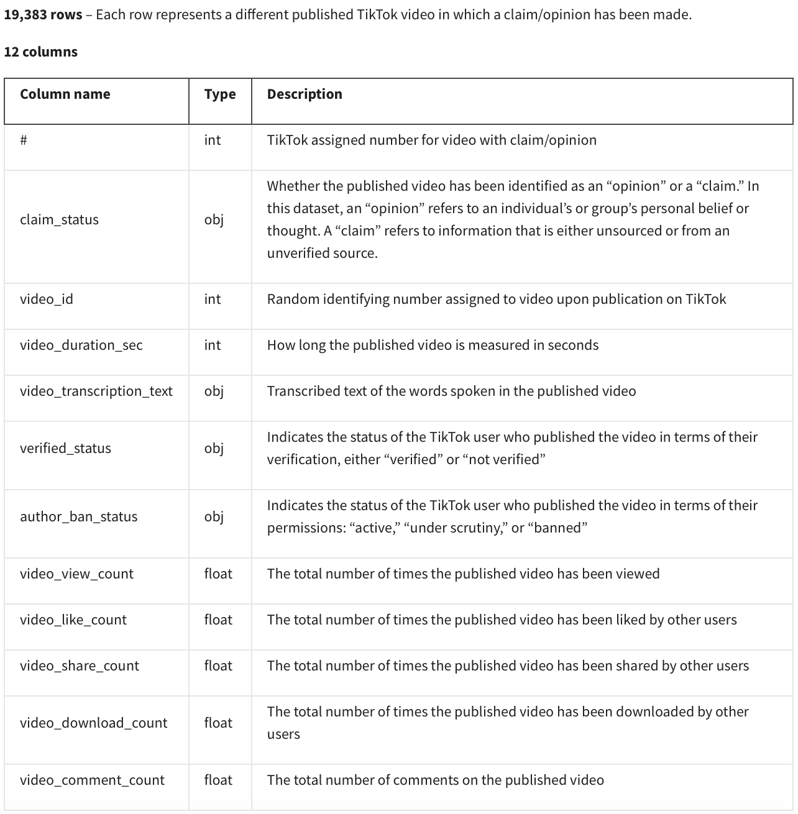
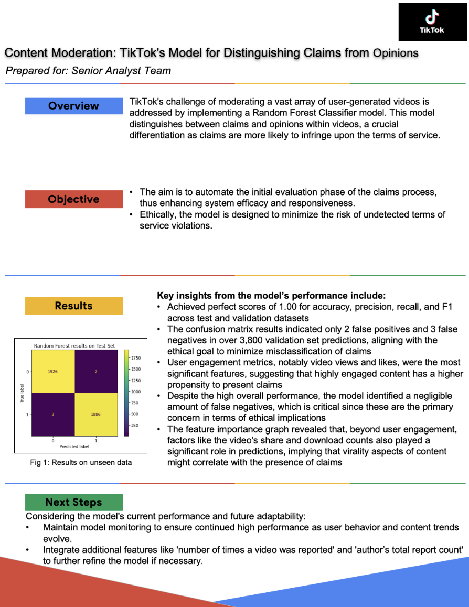

    

## Back Ground:
You are a data professional at TikTok. It has come to notice that users can report videos that they believe violate the platform's terms of service. Because there are millions of TikTok videos created and viewed every day, this means that many videos get reported—too many to be individually reviewed by a human moderator.
Analysis indicates that when authors do violate the terms of service, they're much more likely to be presenting a claim than an opinion. Therefore, it is useful to be able to determine which videos make claims and which videos are opinions.
TikTok wants to build a machine learning model to help identify claims and opinions. 

Your supervisor was impressed with the work you have done and has requested that you build a **machine learning model** that can be used to determine whether a video contains a claim or whether it offers an opinion. With a successful prediction model, TikTok can reduce the backlog of user reports and prioritize them more efficiently.

## Objective:
To build a model to increase response time and system efficiency by automating the initial stages of the claims process. We will use the **Random Forest Classifier** and **XGBoosting** for modelling

- Ethical Implications:
    - The worst case for an `opinion misclassified as a claim` is that the video goes to human review. 
    - The worst case for a `claim misclassified as an opinion` is that the video does not get reviewed _and_ it violates the terms of service. 
    - Therefore, it would be better if the model predicts more **false positives**(opinion misclassified as a claim) than **false negatives**(claim misclassified as an opinion)

## Goal:
To build a model which can predict whether a TikTok video presents a "claim" or presents an "opinion".

## Data Dictionary

# Exectuive Summary

  

