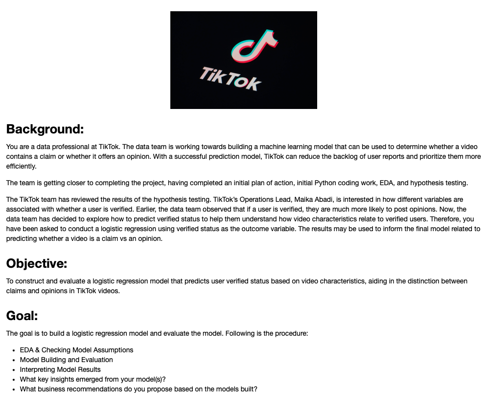

**Disclaimer**: This scenario is hypothetical and designed to simulate a real-world situation. The dataset and its analysis are purely for illustrative purposes to simulate real-world scenarios

# Technical Executive Summary
A logistic regression analysis was conducted to understand the factors influencing the verification status of individuals on a social platform. The model’s performance and the variables' influence are outlined herein to assist strategic planning for engagement and verification protocols.

## Model Efficacy
- **Observations**: The analysis was conducted with 25,037 observations.
- **Fit**: A Log-Likelihood Ratio (LLR) p-value of 0.000 indicates a model fit that is statistically significant from a null model with no predictors.
- **Predictive Power**: The model has a Pseudo R-squared of 0.1037, suggesting that the model explains approximately 10.37% of the variance in verification status, which is a moderate level of explanatory power for social science data.

## Influential Predictors
The logistic regression model identified several key predictors with a notable influence on verification status:

1. **Claim Status Opinion**: The strongest positive predictor, with a coefficient of 1.7277, indicates that a unit increase in the claim status opinion score significantly increases the odds of being verified.
   
2. **Author Ban Status**: The negative coefficient of -0.2958 implies that banned authors are significantly less likely to be verified, underscoring the importance of community guideline adherence.

3. **Video Share Count**: With a coefficient of 1.281e-05, this variable suggests that increased sharing of a video is positively associated with the likelihood of verification.

## Additional Factors
- **Video Duration**: The negative coefficient of -0.0021 implies a minor decrease in verification likelihood with longer video content.
- **Video View Count**: A very small negative coefficient of -4.003e-07 suggests that video view count has a negligible direct effect on the likelihood of verification.

## Model Diagnostics and Validation
- **Precision and Recall**: The model has a precision of 0.75 for verified statuses and 0.64 for non-verified, indicating a higher reliability in predicting verified statuses. Recall indicates a higher sensitivity towards predicting non-verified statuses (0.82).
- **F1-Score**: The F1-score for non-verified statuses (0.72) is higher than for verified statuses (0.62), suggesting better model performance for the non-verified class.
- **Accuracy**: The overall accuracy of the model is 0.68, reflecting a balanced ability to predict both verified and non-verified statuses.

## Confusion Matrix Interpretation
The confusion matrix further validates the model with the following counts:
- True Negatives: 2859
- False Positives: 2494
- False Negatives: 958
- True Positives: 4420

## Recommendations
The insights from this analysis suggest several actionable strategies to optimize the verification process:
- **Community Guidelines**: Reinforce the importance of adhering to community guidelines as reflected by the author ban status.
- **Content Engagement**: Encourage content sharing to increase the odds of verification.
- **Video Content**: Assess and potentially advise on optimal video duration for engagement and verification likelihood.

## Conclusion
The logistic regression model provides a valuable predictive tool for understanding factors that contribute to verification on the platform. By focusing on key predictors and refining content strategies, there is potential to enhance user engagement and increase the rate of verification.

